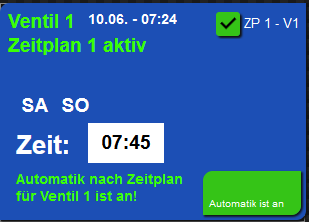

# ioBroker.time_switch_clock

**Tests:** 

## time_switch_clock adapter for ioBroker

Timer for e.g. water valves or lamps e.t.c.

This adapter triggers up to 6 different data points.

## Documentation 

[🇺🇸 Documentation](./Docs/en/README.md) 

[🇩🇪 Dokumentation](./Docs/de/README.md)  

With this adapter you can switch up to 6 different data points at a desired time. 

Here is an example that can be imported into VIS as a view,

 - The Inventwo Widgets are required!

 - Simply import in VIS under VIEW - (copy & paste)
 
<a href="https://github.com/XSDiVer/ioBroker.time_switch_clock/blob/main/Docs/example_View_inventwo"> example VIS View</a>

## Changelog

### **WORK IN PROGRESS**
* Readme update in English & German 

### 0.0.8 (2022-08-06)
* added extended Datapoints in the Mainsetup,
so you can trigger own defined strings - not only 'true' & 'false'

### 0.0.7 (2022-08-01)
* some fixes

### 0.0.6 (2022-07-31)
* added bluefox to collaborators on NPM

### 0.0.5 (2022-07-31)
* NPM fix

### 0.0.4 (2022-07-31)
* Beta Version with example VIS View (needs Inventwo Widges)
and added some datapoints

### 0.0.3 (2022-07-12)
* Beta Version with example VIS View (needs Inventwo Widges)

### 0.0.2 (2022-07-11)
* (XSDiVer) initial release

## License
MIT License

Copyright (c) 2022 XSDiVer <Tachyonen@quantentunnel.de>

Permission is hereby granted, free of charge, to any person obtaining a copy
of this software and associated documentation files (the "Software"), to deal
in the Software without restriction, including without limitation the rights
to use, copy, modify, merge, publish, distribute, sublicense, and/or sell
copies of the Software, and to permit persons to whom the Software is
furnished to do so, subject to the following conditions:

The above copyright notice and this permission notice shall be included in all
copies or substantial portions of the Software.

THE SOFTWARE IS PROVIDED "AS IS", WITHOUT WARRANTY OF ANY KIND, EXPRESS OR
IMPLIED, INCLUDING BUT NOT LIMITED TO THE WARRANTIES OF MERCHANTABILITY,
FITNESS FOR A PARTICULAR PURPOSE AND NONINFRINGEMENT. IN NO EVENT SHALL THE
AUTHORS OR COPYRIGHT HOLDERS BE LIABLE FOR ANY CLAIM, DAMAGES OR OTHER
LIABILITY, WHETHER IN AN ACTION OF CONTRACT, TORT OR OTHERWISE, ARISING FROM,
OUT OF OR IN CONNECTION WITH THE SOFTWARE OR THE USE OR OTHER DEALINGS IN THE
SOFTWARE.
