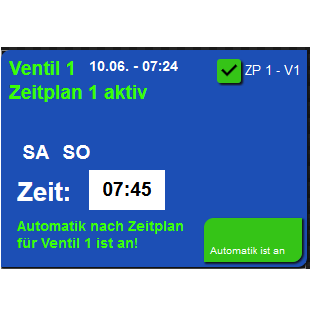

# ioBroker.time_switch_clock

**Tests:** 

## time_switch_clock adapter for ioBroker

Timer for e.g. water valves or other things

Dieser Adapter löst bis zu 6 verschiedene Datenpunkte in "goforit" muss im jeweiligen Trigger eingetragen werden,
welcher Datenpunkt ausgelöst werden soll. Einfach die _id des ensprechenden Datenpunktes kopieren und in goforit einfügen.
Zur eingestellten Zeit wird dieser Datenpunkt dann auf "true" gesetzt.

Die einzelnen trigger können über -SetTrigger- ausgewählt werden.
Einfach die gewünschte Nummer des Triggers der gesetzt werden soll in,
-SetTrigger- eintragen -- Bsp.: für Trigger_1 eine 1 in -SetTrigger- eintragen.

Jetzt kann man über die Datenpunkte: -Montag, Dienstag, Mittwoch, Donnerstag, Freitag, Samstag & Sonntag-
einstellen, an welchem Tag der -trigger_1 - trigger_6- ausgelöst werden soll.

Bei -Uhrzeit- trägt man die Uhrzeit ein, um die der jeweilige -trigger_1 - trigger_6- ausgelöst werden soll.
Die -Uhrzeit- wird im Format -HH:MM- gesetzt. Wobei HH für Stunden und MM für Minuten steht.

Unter "timer" im jeweiligen Datenpunkt - kann man einstellen nach wievielen Minuten der vorher
geschaltete Datenpunkt wieder auf "false" gesetzt werden soll.

Hat man alle -trigger_1 - trigger_6- wie gewünscht eingestellt, 
sollte man  -SetTrigger- auf z.B. 0 setzen -- damit sich durch Änderungen an Uhrzeit
oder Wochentagen -- kein -trigger_1 - trigger_6- verstellt, bzw. neu gesetzt wird.
SetTrigger wird nach 2 Minuten Inaktivität automatisch auf 0 gesetzt.

Dieser Adapter ist vorallem zur Verarbeitung mit der VIS gedacht und soll
das erstellen einer Zeitschaltung erleichtern.

Hier ist ein Beispiel den man im VIS als View importieren kann,
- dient nur zur Veranschaulichung und zum testen:

Die Inventwo Widges werden benötigt!

Einfach im VIS unter VIEW importieren - (copy & paste)
 
<a href="https://github.com/XSDiVer/ioBroker.time_switch_clock/blob/main/Docs/example_View_inventwo"> example VIS View</a>

-- todo: Astro Funktionen sollten implementiert werden.

## Changelog
<!-- Platzhalter für nächstes Change Log. -->

### 0.0.3 (2022-07-12)
* Beta Version with example VIS View (needs Inventwo Widges)

### 0.0.2 (2022-07-11)
* (XSDiVer) initial release

## License
MIT License

Copyright (c) 2022 XSDiVer <Tachyonen@quantentunnel.de>

Permission is hereby granted, free of charge, to any person obtaining a copy
of this software and associated documentation files (the "Software"), to deal
in the Software without restriction, including without limitation the rights
to use, copy, modify, merge, publish, distribute, sublicense, and/or sell
copies of the Software, and to permit persons to whom the Software is
furnished to do so, subject to the following conditions:

The above copyright notice and this permission notice shall be included in all
copies or substantial portions of the Software.

THE SOFTWARE IS PROVIDED "AS IS", WITHOUT WARRANTY OF ANY KIND, EXPRESS OR
IMPLIED, INCLUDING BUT NOT LIMITED TO THE WARRANTIES OF MERCHANTABILITY,
FITNESS FOR A PARTICULAR PURPOSE AND NONINFRINGEMENT. IN NO EVENT SHALL THE
AUTHORS OR COPYRIGHT HOLDERS BE LIABLE FOR ANY CLAIM, DAMAGES OR OTHER
LIABILITY, WHETHER IN AN ACTION OF CONTRACT, TORT OR OTHERWISE, ARISING FROM,
OUT OF OR IN CONNECTION WITH THE SOFTWARE OR THE USE OR OTHER DEALINGS IN THE
SOFTWARE.
